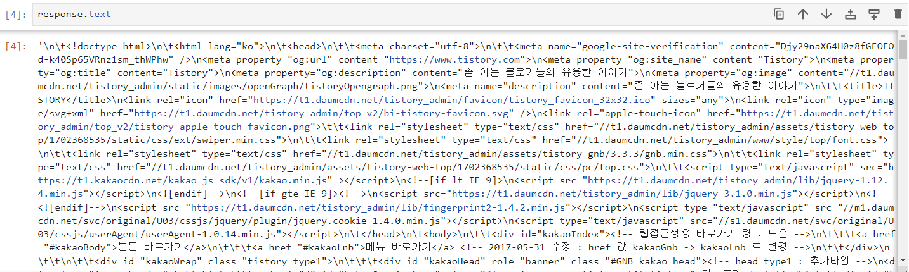
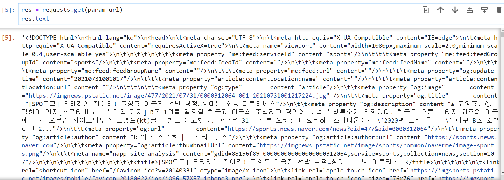
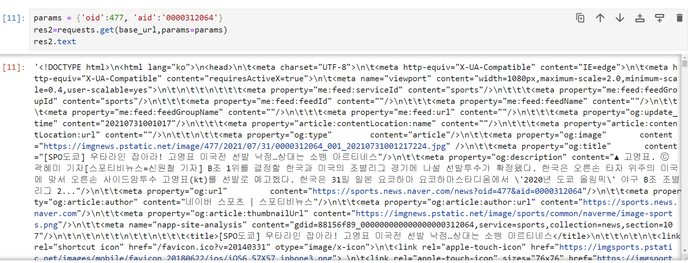
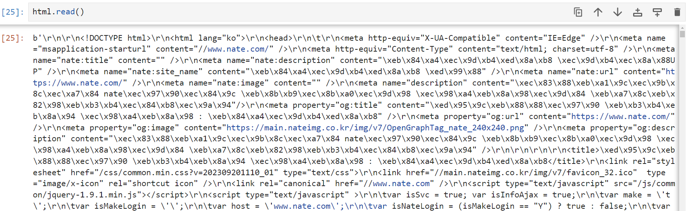
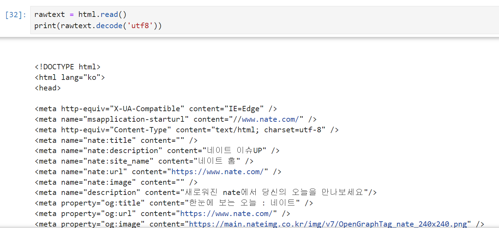
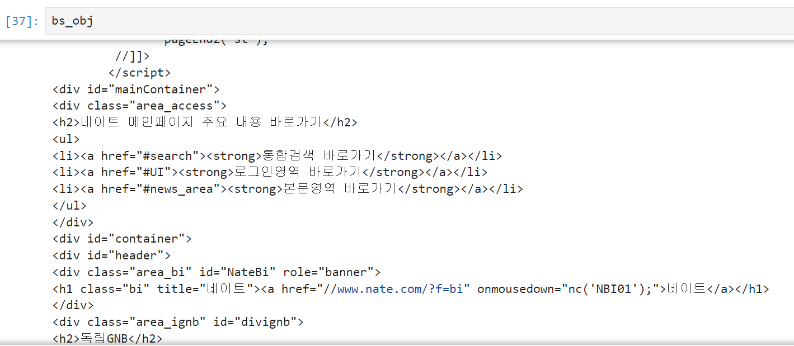
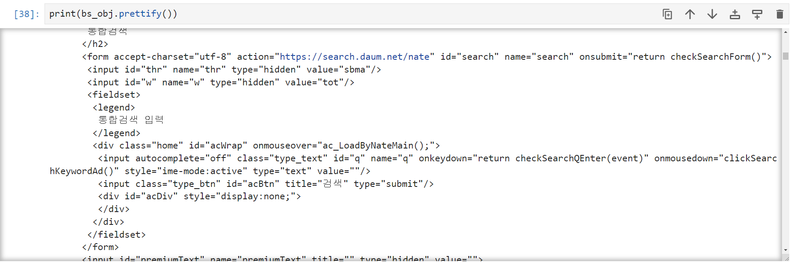

# 크롤링 문법 및 라이브러리 소개
**Content**
- requests
- urllib
- BeautifulSoup

## 1. requests
- 파이썬을 이용하여 **HTTP 통신**이 필요할 때 가장 많이 사용되는 라이브러리 중 하나
- 가볍고, 실행속도가 빨라 원격에 있는 **API 호출**에 많이 사용한다.
- **HTTP**에 요청을 보내는 모듈   
  
`GET` 방식을 사용해 URL에 해당하는 내용들을 가져올 수 있다.
```python
# requests 모듈 불러오기
import requests

# 불러올 http/https url 주소
url = 'http://www.tistory.com'

# get 방식을 통해 url에 대한 정보 불러오기
res = requests.get(url)
```

`.status_code`를 통해 응답에 대한 상태코드를 받아올 수 있다.

```python
res.status_code

>> 200
```

<**응답에 대한 상태코드**>   
- 200 : 정상응답   
- 400번대 코드 : 클라이언트의 요청이 잘못되었음(url주소가 틀렸거나 권한이 없는 페이지를 요청했을 수 있다.)   
- 500번대 코드 : 클라이언트는 문법에 맞게 요청을 했지만, 서버측에서 인증이 안되었거나 서버가 망가진 상태

`.text`를 통해 요청에 의해 전달된 코드를 확인할 수 있다
   
> 브라우저가 사이트에 요청해서 받은 결과 코드와 동일한 코드가 문자열 형태로 반환된다.

### 서버에 파라미터 전달 방법
  > 파라미터 전송 방법은 url `?`기호 뒤에 **파라미터=값&파라미터2=값** 형태로 전송할 수 있다.

1. **URL에 파라미터를 포함해 GET 방식으로 전달하기**
    ```python
    base_url = "https://sports.news.naver.com/news" # 기본 url
    param_url ="https://sports.news.naver.com/news?oid=477&aid=0000312064"  # 파라미터가 포함된 url
    
    res = requests.get(param_url)
    ```
    
    > 파라미터에 해당되는 url 페이지의 소스코드를 가져온다.

2. **딕셔너리를 활용한 URL 파라미터 전달**
    ```python
    base_url = "https://sports.news.naver.com/news" # 기본 url

    # 전달할 파라미터 : oid=477&aid=0000312064
    # 전달할 파라미터를 딕셔너리 형태로 만들기
    params = {'oid' : 477, 'aid' : '0000312064'}

    # base_url에 해당하는 파라미터를 전달하고 GET방식으로 요청하기
    res2 = requests.get(base_url, params=params) 
    ```
    
    > 전달할 파라미터를 딕셔너리 형태로 구성하고 GET방식으로 요청 시 직접 URL을 작성하는것보다 편하게 전달할 수 있다.

## 2. urllib
- requests 모듈과 비슷하게 HTML을 다운로드 받고, Beautifulsoup로 데이터를 추출하는 방식
- requests와 비슷하게 속도가 빠르며 가볍고, 조작이 쉬운 특징이 있다.

### urllib 패키지를 활용한 소스 코드 추출
1. `urlopen` 모듈을 활용해 url에 요청 보내기
    ```python
    from urllib.request import urlopen  # url에 요청을 보낼 모듈 불러오기

    url = "https://www.nate.com"  # 불러올 url 주소
    html = urlopen(url)  # urlopen 함수에 불러올 url 주소 담기


    html
    # url에 대한 소스코드 정보가 담긴 html 응답 객체 생성
    >> <http.client.HTTPResponse at 0x1e99a895f30> 
    ```
2. 응답객체에서 url 소스코드 읽어오기
   > 응답객체.`read()` - 한번 읽어오면 그 후 다시 읽을땐 빈 문자열이 나옴
   
   > 텍스트가 바이트로 인코딩된 소스 코드가 추출된다. 이를 해결하기 위해 decode 필요함

3. `decode('utf8')`을 활용해 html문서 추출
   바이트화되어 추출된 문서를 `decode('utf8')`을 활용해 변환할 수 있다.
   
   `read()`로 읽어온 응답객체변수를 `.decode('utf8)` 메서드를 이용해 url에 나타나는 소스코드 원본을 추출할 수 있다

## 3. BeautifulSoup
- `import bs4`
- 데이터를 추출하는데 필요한 기능이 들어 있는 라이브러리(**파싱** 라이브러리)
  - 파싱이란 ?
    - Parsing : 구문분석
    - 웹페이지에서 원하는 데이터를 추출하여 가공하기 쉬운 상태로 바꾸는 것
- **tag**형식으로 된 **text**를 파싱할 때 사용
- find()/findAll() 등 원하는 내용을 추출할 수 있는 다양한 함수가 존재함

### urlopen으로 전달받은 응답객체를 bs4로 파싱하기
bs4의 기능중 `BeautifulSoup(응답객체, 파서기)`가 존재   

해당 기능을 이용해 urlopen으로 불러온 응답객체를 파싱할 수 있다.

```python
from urllib.request import urlopen  # url에 요청을 보낼 모듈 불러오기
import bs4  # 파싱하기 위한 모듈 불러오기

url = "https://www.nate.com"  # 불러올 url 주소
html = urlopen(url)  # html 응답객체 생성
bs_obj = bs4.BeautifulSoup(html, 'html.parser')  # html.parser 파서기를 활용해 url문서 파싱

type(bs_obj)
# bs4 모듈을 사용할 수 있는 bs_obj 객체가 생성됨
>> bs4.BeautifulSoup
```


응답객체에 url의 html 소스코드가 담긴모습을 확인할 수 있지만, 태그끼리의 계층구조가 표현되지 않아 가독성이 불편한 모습을 확인 할 수 있다.

이를 해결하기 위해, `.prettify()` 함수를 사용할 수 있다.

`prettify()` : HTML 소스코드를 들여쓰기 하여 계층적인 구조로 표현하게 해주는 함수(**가독성이 높아지는 장점이 있다**)

## 3.1 BeautifulSoup 파싱 함수
- **find(태그, {속성명:속성값})**
  - 지정한 태그 중 첫번째 만나는 태그만 추출
  - 지정한 태그 중 해당 속성과 속성값을 갖고있는 태그의 첫번째 태그

- **findAll(태그, {속성명:속성값})**
  - 지정한 태그를 모두 찾아서 추출함
  - 첫번째 이외의 태그를 추출할 때 사용
  - **list**형태로 반환됨

- **find_all(태그, {속성명:속성값})**
  - findAll 함수와 기능이 동일