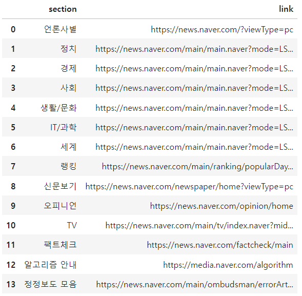

# 포털사이트 크롤링
## Content 
- 네이트 메뉴 크롤링
  - 네이트 메뉴명, 링크 수집 후 데이터 저장
- 네이버 뉴스 크롤링
  - 네이버 뉴스 섹션 메뉴명, 링크 수집 후 데이터 저장
  - 언론사 뉴스 크롤링

## 네이트 메뉴 크롤링
### 목표 
포털사이트(네이트) 메뉴에 해당하는 소스코드 태그를 찾아 메뉴에 해당하는 이름과 링크 주소를 데이터프레임으로 생성 후 저장하기

**네이트 메인 메뉴 목록**   
: 메일, 뉴스, 판 , AI챗, TV, 툰앤북, 운세,게임 ,쇼핑, 팀룸, 네이트뷰, 더보기   
(더보기 메뉴엔 메인 메뉴와 중복되는 메뉴 + 그 외 메뉴가 포함되어있음)


### 1. 필요한 라이브러리 불러오기
```python
import pandas as pd
import bs4
import requests
from urllib.request import urlopen
```
데이터프레임 생성 및 저장, 데이터 크롤링하기 위한 라이브러리들 불러오기.

### 2. URL 소스코드 받아오기
   > urlopen() 함수로 응답객체 생성하기
   ```python
   url = 'https://www.nate.com'  # 크롤링할 url주소 입력

   html = urlopen(url)  # 네이트사이트에 대한 응답을 받아오는 응답객체 생성

   html_text = html.read()
   html_text
   ```

   
   
  **bs4 객체를 생성해 바이트화된 텍스트를 한글 텍스트로 변환**
   ```python
   bs_obj = bs4.BeautifulSoup(html_text, 'html.parser')  # 파싱할 객체를 파서기(html.parser)에 할당해 파싱하기
   bs_obj.text
   ```
   
  
   **`prettify()`함수를 통해 html 소스코드 가독성 높게 만들기**
   ```python
   bs_obj.prettify()
   ```
   

### 3. 메뉴에 해당하는 태그 찾기
> 사이트의 메뉴에 해당하는 데이터를 파싱하기 위한 적절한 태그를 소스코드에서 찾아와 파싱하기

1. 메뉴 전체 부분을 감싸고 있는 div 태그를 찾을 수 있다.
2. div태그 하위 계층 테그는 각 메뉴를 나타내는 li태그로 묶여진 ul테그로 구성되어있다.


id="divGnb", class="area_gnb"의 속성값을 가진 div태그가 메인메뉴 전체를 감싸고 있다.
   
**태그가 div 태그이면서 id="divGnb", class="area_gnb"에 해당하는 데이터를 가져오자**
```python
# find함수를 이용해 할당한 속성에 대한 속성값을 가진 div 태그에 해당하는 내용 가져오기
menu  = bs_obj.find('div', {'id':'divGnb'})

menu_li = menu.select('li')  # div태그안의 모든 li태그를 리스트형태로 가져오기

menu_li
```


- 메뉴태그에 해당하는 **메뉴목록 li 태그**를 가져온 모습
- 메뉴에 해당하는 text와 해당 메뉴로 이동할 수 있는 링크가 담겨있는 a태그가 포함되어 있는 모습을 확인할 수 있다.
  
### 4. 메뉴이름과 링크 추출하기
> li태그에 들어있는 메뉴이름과 링크를 추출해보자.
```python
# 각 li태그의 텍스트와 링크주소 가져오기
for li in menu_li:
  print(li.text, li.a['href'])
```

```
<result>
메일 https://mail3.nate.com/#index
뉴스 //news.nate.com/
판 https://pann.nate.com/
AI챗beta https://m.nate.com/aichat.html
TV https://tv.nate.com/
툰앤북 https://toonnbook.nate.com/
운세 https://fortune.nate.com/home/main.nate
게임 http://game.nate.com/
쇼핑 //shopping.nate.com/
팀룸 https://nateonweb.nate.com/teamroom/
네이트뷰 https://view.nate.com/

더보기


뉴스
날씨
스포츠
연예
아이돌24
    랭킹뉴스


판
톡톡
판포토
팬톡


네이트온
네이트캐쉬
문자메시지
주소록


컬러링
이슈UP추천

서비스 전체보기
더보기 닫기

javascript:;
뉴스 //news.nate.com
날씨 //news.nate.com/Weather
스포츠 //sports.news.nate.com/
연예 //news.nate.com/ent/index
아이돌24 //news.nate.com/ent/idol24
랭킹뉴스 //news.nate.com/rank/interest
판 https://pann.nate.com/톡톡 https://pann.nate.com/talk
판포토 https://pann.nate.com/talk/imageTheme/index
팬톡 https://pann.nate.com/fantalk
네이트온 //nateonweb.nate.com/
네이트캐쉬 //cash.nate.com/center/cashMain.sc
문자메시지 https://sms.nate.com/
주소록 https://mail.nate.com/pims/
컬러링 //mobile.nate.com/
이슈UP추천 //editor.nate.com/
```
- li태그마다 메뉴이름과 링크가 추출되는 모습을 확인할 수 있다.
- 하지만 javascript로 작성된 코드와 중복된 메뉴, 링크가 같이 추출되는 모습도 확인할 수 있다. 

### 5. 중복된 메뉴, 링크와 불필요한 데이터 제외시킨 후 데이터 DF로 생성 후 저장하기
- 빈 DF 생성 후 데이터를 행으로 추가 후, 각각의 행을 concat 결합시키기
- 조건문을 통해 javascript 코드 및 중복된 메뉴와 링크는 제외

```python
import pandas as pd  # 데이터프레임 생성 위한 라이브러리
nate_menu = pd.DataFrame({'menu' : [], 'link' : []})  # 메뉴와 링크주소를 받아오르 빈 데이터프레임 생성

menu_li = menu.select('li')  # li태그의 정보를 리스트로 받아옴

index = 0
for li in menu_li:
  menu_text = li.text  # 메뉴 추출
  menu_link = li.a['href']  # 링크주소를 추출

  if menu_link == '' or menu_link == 'javascript:;' or menu_text in nate_menu['menu'].value:
    continue  # 링크주소가 비어있거나 javascript로 작성되었거나 메뉴가 이미 존재하면 continue
  
  # 임시 데이터프레임을 생성한 후 데이터를 한 행에 추가
  tmp = pd.DataFrame({'menu':menu_text, 'link':menu_link}, index=[index])
  # 기존에 생성한 데이터프레임과 concat해 데이터를 한 행씩 추가시키도록 함
  nate_menu = pd.concat([nate_menu, tmp])
  index += 1  # 한 행 추가 후 인덱스 증가

nate_menu  # 생성된 데이터프레임 확인
```

> 총 25개의 중복없는 메뉴와 링크주소가 저장된 모습을 확인할 수 있다.

#### 수집 데이터 저장
```python
# DataLake 생성
# crawl_data 디렉터리가 존재하지 않으면 생성
import os

if not os.path.exists('crawl_data'):
  os.makedirs('crawl_data')

# 생성한 데이터프레임을 해당 디렉터리에 저장
nata_menu.to_csv('./crawl_data/nate_menu.csv')
```

## 네이버 뉴스 크롤링
### 목표
네이버 뉴스 메인페이지에서 뉴스 섹션들과 그에 해당하는 링크를 크롤링을 통해 추출 후 수집한다. 


### 1. 네이버 뉴스 메인 페이지 파싱하기
```python
url = 'https://news.naver.com'  # 크롤링할 url 설정

html = urlopen(url)  # urllib의 urlopen 함수로 응답객체 변수 생성

html_text = html.read()  # read() 함수로 응답객체에 소스코드로 가져오기

# bs4의 html 파서기를 통해 bs4 객체 생성하기
news_obj = bs4.BeautifulSoup(html_text, 'html.parser')

# prettify() 함수를 통해 원본 소스코드와 동일하게 변환
news_obj.prettify()
```


네이버 뉴스 메인 페이지의 소스코드를 가져옴

### 2. 뉴스 메뉴, 링크를 포함하는 태그 파싱

- div class = Nlnb._float_lnb 태그가 메뉴 전체를 포함하고 있는 최상위 태그인것을 확인
- copy selector를 통해 해당 태그의 selector를 가져와서 파싱 진행

```python
news_obj.select('body > section > header > div.Nlnb._float_lnb > div')
```

   
- 뉴스 섹션 이름과 링크가 포함되어있는 li태그를 ul태그로 감싸져있는 형태를 확인할 수 있다.

- ul태그에 해당되는 내용들을 추출하기 위해 ul태그를 새로운 변수로 생성하고 li태그에 대한 데이터를 추출한다.
```python
# ul태그에 해당하는 데이터 가져오기
news_obj.select('body > section > header > div.Nlnb._float_lnb > div')[0].ul  
# <ul class="Nlnb_menu_list" role="menu">

# class를 이용해 원하는 ul태그에 대한 정보를 가져옴
ul = news_obj.find('ul', {'class':'Nlnb_menu_list'})

# ul태그 안에 있는 모든 li태그에 대한 정보를 가져옴
lis = ul.findAll('li')
# 뉴스 섹션의 개수는 14개인것을 알 수 있다.
len(lis)

>> 14
```

### 3. 링크 및 중복되는 메뉴 확인
```python
# li태그를 하나씩 가져와 섹션 이름과 링크가 들어있는 a 태그의 text와 ['href']속성을 추출해 
# 중복되는 링크와 메뉴가 없는지 확인
for li in lis:
  a_tag = li.find('a')
  print(a_tag.text, ':', a_tag['href'])
```

> 총 14개의 중복없는 섹션 및 링크가 추출됨

### 4. 수집 데이터로 DF 생성 후 저장
리스트에 각 컬럼 데이터를 모은 후 df로 구성

```python
section = []
link = []

# 각 li태그의 섹션명과 링크명을 section, link 리스트에 각각 저장
for li in lis:
  a_tag = li.find('a')
  section.append(a_tag.text)
  link.append(a_tag['href'])

section
link
```


> 추출한 데이터를 데이터프레임으로 생성
```python
col_dict = {'section' : section, 'link' : link}

naver_news_df = pd.DataFrame(col_dict)
```


> DataLake에 추출한 데이터프레임 저장
```python
naver_news_df.to_csv('/crawl_data/naver_news_section.csv')
```
