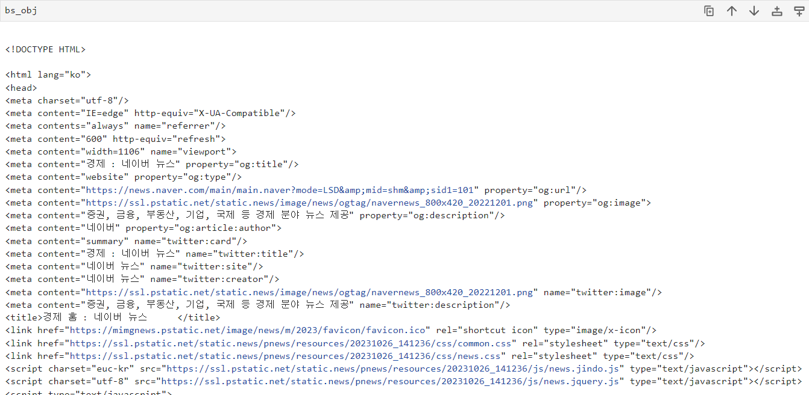
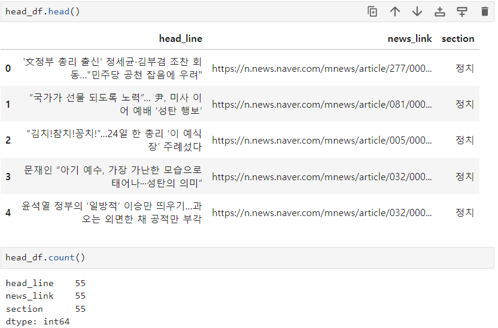

# 네이버 뉴스 크롤링
## Content
- 뉴스 섹션별 헤드라인 제목, 링크, 섹션이름 크롤링하기
- 데이터레이크에 저장된 뉴스 섹션별 링크 데이터프레임을 이용해 각 섹션별 헤드라인 및 링크 등을 추출해온다.
- 자동화로 크롤링할 수 있는 함수 구성

## 1. 하나의 섹션에 대해 헤드라인 제목 및 링크 추출하기
### 1.1 섹션 메뉴, URL 불러와서 원하는 URL 서버에 요청 후 응답받기
```python
# 필요한 라이브러리 불러오기
from urllib.request import urlopen
import requests
import pandas as pd
from bs4 import BeautifulSoup

# 섹션 메뉴와 URL을 저장하고 있는 file 불러오기
df_menu = pd.read_csv('./crawl_data/naver_news_section.csv', index_col=0)
df_menu.head()

>> result
section	link
0	언론사별	https://news.naver.com/?viewType=pc
1	정치	https://news.naver.com/main/main.naver?mode=LS...
2	경제	https://news.naver.com/main/main.naver?mode=LS...
3	사회	https://news.naver.com/main/main.naver?mode=LS...
4	생활/문화	https://news.naver.com/main/main.naver?mode=LS...
```

### 1.2 경제 섹션 url 추출 후, 요청/응답 받기
- url 서버에 응답 요청시 사이트에서 봇으로 보고 연결을 끊는 경우 해결방법
    - 통신 규칙상 웹으로의 요청은 브라우저를 통해서 요청하는 것이 약속
    - 소스코드로 요청하면 서버측에서는 공격으로 인지 할 수 있음 : 공격으로 인지되면 서버측에서 연결을 끊어버림
    - 서버에 요청시 **header**를 추가해서 봇이 아님을 증명해야 함
      - 요청 시 header에 브라우저의 종류를 추가해서 요청해야 함(data-useragent 추가)
      - 사용할 브라우저의 정보를 header에 추가하기

```python
# header를 포함한 요청하기
# requests.get() 함수 사용하기
url = df_menu['link'][2]  # 경제 섹션의 url 가져오기

headers = {'User-Agent':'Mozilla/5.0 (Windows NT 10.0; Win64; x64) AppleWebKit/537.36 (KHTML, like Gecko) Chrome/120.0.0.0 Safari/537.36'}  # url의 data-useragent header로 설정

res= requests.get(url, headers=headers)  # headers 파라미터를 추가해 requests.get() 메서드를 통해 요청, 응답 받아오기

html = res.text  # 소스코드를 요청해 저장

bs_obj = BeautifulSoup(html, 'html.parser')  # 파싱 위한 bs4 객체 생성

bs_obj
```


### 1.3 헤드라인 뉴스 제목 및 내용 추출
```python
head_L = bs_obj.findAll('div', {'class':'sh_text'})

len(head_L)

>> 10  # 총 10개의 헤드라인 뉴스가 있다.

head_L[0].a.text  # 첫번째 뉴스의 제목
'LG전자,  고사양 초경량 노트북 ‘LG 그램 프로’ 출시'

head_L[0].a['href']  # 첫번째 뉴스의 링크주소
'https://n.news.naver.com/mnews/article/082/0001248166?sid=101'

head_L[0].div.text  # 첫번째 뉴스의 내용
'LG전자는 최신 AI(인공지능) 프로세서를 탑재해 성능을 높이면서 두께는 더욱 줄인 2024년형 LG 그램 신제품 ‘LG 그램 프로’를 출시한다고 25일 …'

head_L[0].find('div', {'class':'sh_text_press'}).text  # 첫번째 뉴스의 언론사 이름 
'부산일보'
```

### 1.4 모든 헤드라인 뉴스에 대해 제목 및 내용 추출
```python
# for문을 통해 각 헤드라인 뉴스 별 정보를 추출
for head in head_L:
    head.a.text
    head.a['href']
    head.div.text
    head.find('div', {'class':'sh_text_press'}).text
```

### 2. 모든 뉴스 섹션에 적용 가능하도록 함수로 구성하기
- 6개 섹션의 헤드라인 뉴스에 대한 뉴스 제목, 각 뉴스의 link, 뉴스의 섹션을 df로 저장
- 섹션별 수집 데이터를 dict 구성 후 반환하기

```python
def get_headline(url, section):
    # 딕셔너리 구성 위해 수집 데이터를 저장할 빈 list 생성
    head_title = []
    head_link = []

    # 헤더를 추가해 url 요청, 응답 받아오기
    headers = {'User-Agent':'Mozilla/5.0 (Windows NT 10.0; Win64; x64) AppleWebKit/537.36 (KHTML, like Gecko) Chrome/120.0.0.0 Safari/537.36'}
    res = requests.get(url, headers=headers)

    # bs4 객체(파서기) 생성
    html = res.text  # 소스코드 전달받기
    bs_obj = BeautifulSoup(html, 'html.parser')

    # headline 뉴스 추출
    head_L = bs_obj.findAll('div', {'class':'sh_text'})

    for head in head_L:
        head_title.append(head.a.text)  # 기사 제목
        head_link.append(head.a['href'])  # 기사 링크 
    
    return ({'head_line':head_title, 'news_link':head_link, 'section':section})
```

### 2. 모든 섹션에 함수 적용 후 DF로 생성
- get_headline 함수가 dict로 반환하므로
- temp_df 생성 후 누적 df에 결합해서 모두 누적
```python
# 모든 뉴스를 저장할 빈 df 생성
head_df = pd.DataFrame({'head_line':[], 'news_link':[], 'section':[]})

for i in range(1, 7):
    # 언론사별 섹션 제외 나머지 섹션별로 함수가 반환한 data로 df 구성
    temp = pd.DataFrame(get_headline(df_menu['link'][i], df_menu['section'][i])) 

    # 반환한 데이터가 들어있는 temp와 head_df를 concat 모든 데이터를 합침
    head_df = pd.concat([head_df, temp], axis=0, ignore_index=True)

display(head_df.head())
print(head_df.count())
```


> **모든 섹션에 대한 헤드라인 뉴스 정보가 추출된것을 학인할 수 있다.**