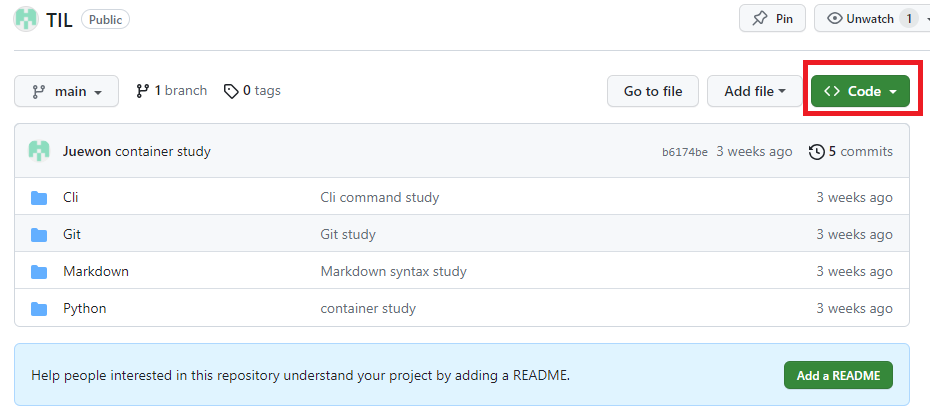
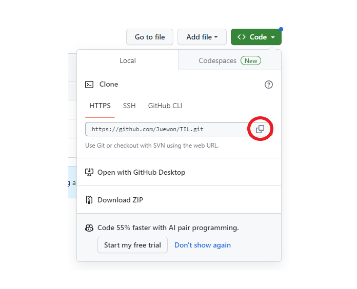
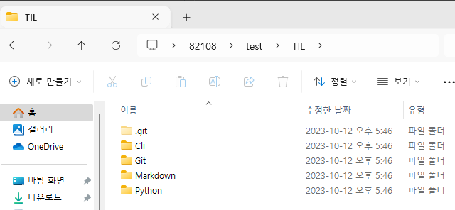
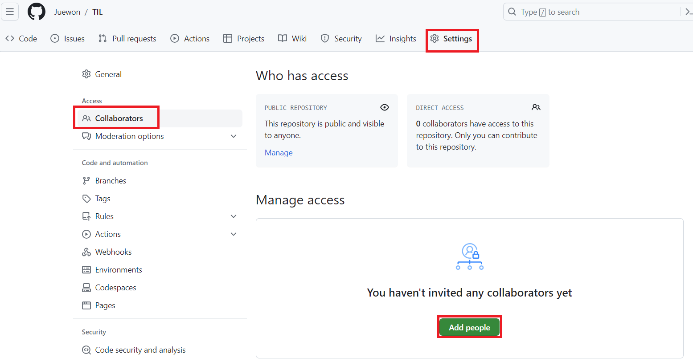

# GIT02
## `git remote`
- `git remote` : 원격저장소의 정보를 알고싶을때 사용
  ```python
  $ git remote 
  => origin  # 원격저장소의 이름
  ```
- `git remote -v` : 원격저장소의 정보를 더 자세히 알고싶을때
  ```python
  $ git remote -v
  => origin  https://github.com/Juewon/TIL.git (fetch)
     origin  https://github.com/Juewon/TIL.git (push)
  ```

## `git push`
- `git push` : 로컬저장소의 파일을 원격저장소로 민다
- `git push [저장소이름] [브랜치이름]`
  ```python
  $ git push origin main
  ```

  ## `git diff`
- `git diff`
  - Working directory와 Staging Area 사이의 차이를 확인하기 위해 사용한다.
  - 변경 사항이 git add를 통해 Staging Area로 넘어갔으면 git diff에는 아무것도 나타나지 않게된다.
- `git diff HEAD`
  - **Working directory와 Staging Area의 변경사항 모두를**  Repository의 HEAD 커밋과 비교한다.
  - `git diff`와 달리 Staging Area로 올라가서 안보였던 변경사항은 `git diff HEAD`를 이용해 볼 수 있다.
- `git diff --staged`
  - **Staging Area와 Repository HEAD 커밋 사이의 변경사항을** 확인하기 위해 사용한다. 

## `git checkout`
- `git checkout [commit hash]`
  - 원하는 커밋시점으로 Rollback 할 수 있다.
  ```python
  $ git log --oneline

  => b6174be (HEAD -> main, origin/main) container study
     e826869 Python Study
     5c2929e Markdown syntax study
     89ecd23 Cli command study
     7888a27 Git study
  ```

  ```python
  $ git checkout 7888a27  
  # 해당 커밋해시 시점으로 Rollback된다.
  ```
  
  ```python
  $ git checkout main
  # 다시 현실로 돌아오기
  ```
## `git clone`
> `git clone [repository 주소]` : 저장소에 저장되어있는 프로젝트를 내 로컬 폴더에 복사해 저장다.   

> 나의 repository에서 TIL 프로젝트를 로컬로 복사해보자

1. 오른쪽 위에 보이는 Code를 클릭
     

2. clone 해야 할 repository 주소를 복사
  

3. clone한 directory를 원하는 로컬폴더(test)에 붙여넣기
   ```python
   $ git clone [repository 주소]
   ```
   

4. test폴더에 clone완료
    
  
> `git clone [repository 주소] [바꿀폴더이름]` : clone할 프로젝트 폴더를 사용자가 원하는 폴더 이름으로 로컬로 clone해온다.

## `git 연결종료`
-  `rm -r .git` : .git 파일을 제거하면서 git에 대한 연결 종료함   
-  `rm -rf .git` : .git 파일을 제거하는것에 대한 경고 메시지를 모두 수락하며 지움 
   -  단, 작업이력이 모두 삭제되어 프로젝트 진행 도중 사용하지 않는다.
   -  협업 프로젝트에서는 .git 폴더 삭제 지양

## `git pull`
- `git pull [repository name] [branch name]`
  - `git pull origin main`
  - 원격 저장소의 저장된 파일과 로컬에 저장된 파일의 커밋 차이를 반영해서 로컬로 가져온다.

## GitHub 사용 시 주의 사항
- 터미널 git 프로젝트(main) 안에 또 다른 `git init` 하지 말기
- git 프로젝트(main) 폴더 상위 폴더에 또 다른 `git init` 하지 말기

## GitHub 협업 과정
1. 팀원
  - 팀장 프로젝트 repository 주소 받아오기
  - `$ git clone [팀장 repository 주소]`
  - `git pull`로 새로 저장된 원격 저장소의 작업 이력을 가져온 후 작업 시작
  - 로컬에서 작업 후 commit => push 하기
    - 팀장 프로젝트에 push하기 위해선 팀장에게 **권한을 받아야 한다.**

2. 팀장
  - 팀원에게 권한 주기
    - 해당 프로젝트 **repository의 settings** => Access의 Collaborators에서 `Add people`로 push 권한 승인 할 팀원 추가
    
  - 팀원이 쓴 문서 받아와서 이어 쓰기
    - `git pull origin main` <문서 가져오기>
    - `pull`받고 `add` -> `commit` -> `push`로 추가 작성한 문서 원격 저장소에 업데이트


  