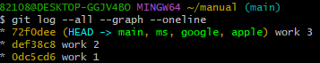
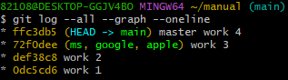
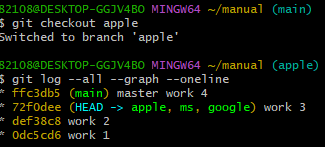
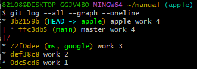

# GIT03
## Branch
> 같은 뿌리에서 나왔지만 서로 다른 역사를 써가고있는 버전들을 말함

### `git log -p`
> 파일의 로그 별 변경사항들을 표시

### `git branch`
> 브랜치의 목록 표시

### `git branch [branch_name]`
1. `git branch apple`
   - `apple`이라는 새로운 브랜치 생성
   -  
   - 기존에 있던 main 브랜치 이름 뒤에 새로 생성한 apple 브랜치가 생성됨을 확인 할 수 있다.
   - `HEAD` : 포인터의 개념, 현재 사용중인 main 브랜치를 가리키고 있음

2. branch 추가 생성
   - 
   - 총 4개의 브랜치를 생성하였고, 위 4개의 브랜치는 현재 사용중인 main 브랜치 머물고 있는 work 3 상태에서 만들었기 때문에 모두 work 3 상태의 공통점을 갖고 있는 상태임 

3. branch 추가 후 새 커밋 추가
   - 
   - HEAD가 가리키고 있는 main만 새로운 커밋을 가리키고, 나머지 브랜치(ms, google, apple)들은 work 3인 상태로 남아있는 모습

4. `git checkout [branch_name]`
    - HEAD를 checkout으로 지정한 브랜치 이름으로 이동시킴
    - 
    - HEAD가 apple로 이동하면서 work 3에서 작업하던 상태로 이동한다.
    - work 4에 작성된 내용은 없어지는 현상 발생
    - `git checkout main`시 work 4에서 작업했던 내용들이 다시 생성됨

### `git log -- --all --graph --oneline`
> git log를 그래프적으로 표현하게 해주는 명령어
- 
    - **apple의 apple work 4**와 **main의 master work 4** 시대의 **부모**는 **work 3**라는 의미를 갖고 있음