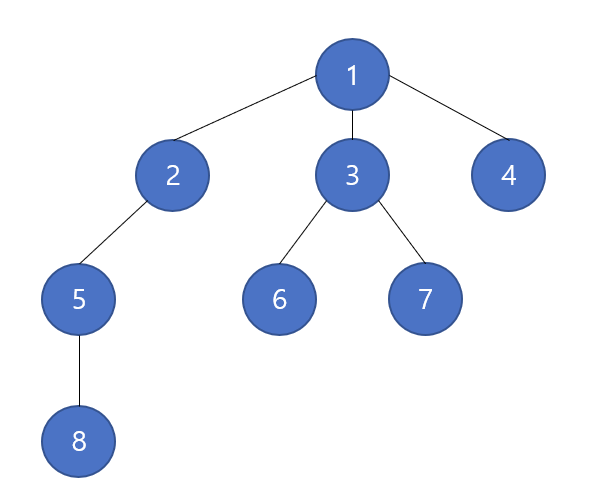

# 그래프 탐색 알고리즘(DFS / BFS)
그래프란 ?   
여러 개체들이 연결되어 있는 자료구조

**대표적 문제 유형**   
1. 경로탐색 유형(최단거리, 시간)
2. 네트워크 유형(연결)
3. 조합 유형(모든 조합 만들기

## DFS(Depth First Search)
DFS(깊이 우선 탐색)이란 ?

DFS는 시작 정점에서 **한 방향**으로 계속 가다가 **더 이상 갈 수 없게 되면 다시 가장 가까운 갈림길로 돌아와서 다른 방향으로 다시 탐색**을 진행하는 방법

<p align="center">
  
</p>

이와 같이 그래프가 있을 경우 DFS는 **한 방향**으로 진행된다.   
그래프의 시작 정점에서 출발해 시작 정점 **v(1)** 를 방문했다고 표시한다. 이어서 v에 인접한 정점들 중 아직 방문하지 않은 정점 **u(2)** 를 선택한다. 만약 그러한 정점이 없다면 탐색은 종료한다. 만약 아직 방문하지 않은 정점 u (1 > 2 > 5 > 8의 탐색이 끝난 후, **3을 선택**) 가 있다면 u를 시작 정점으로 하여 DFS를 다시 시작한다. 이러한 과정을 반복한다.   
위 과정을 반복하면 해당 그래프의 순서는 **1 > 2 > 5 > 8 > 3 > 6 > 7 > 4**가 된다.

### DFS의 단점
수행 시간 관점에선 복불복일수도 있다.   
운이 좋으면 첫 번째 조합이 최적의 답일수도 있지만, 최악의 경우에는 모든 조합을 다 만들어보면서 시간을 낭비할 수 있다.

### DFS의 기본 원칙
DFS에서 데이터를 찾을 땐 항상 **앞으로 찾아서 가야할 노드**와 **이미 방문한 노드**를 기준으로 데이터를 탐색한다.

그래서 특정 노드가 **앞으로 찾아서 가야할 노드**라면 계속 검색을 하는 것이고, **이미 방문한 노드**면 무시하거나 따로 저장하면 된다.

### DFS의 구현 방식
DFS를 구현할 땐 기본적으로 **스택/큐**를 활용할 수 있고, **재귀함수를 통해 구현**할 수도 있다.

### 재귀함수를 통한 DFS 구현
```python
graph = dict()
 
# 그래프 설계
graph['A'] = ['B', 'C']
graph['B'] = ['A', 'D']
graph['C'] = ['A', 'G', 'H', 'I']
graph['D'] = ['B', 'E', 'F']
graph['E'] = ['D']
graph['F'] = ['D']
graph['G'] = ['C']
graph['H'] = ['C']
graph['I'] = ['C', 'J']
graph['J'] = ['I']
```

```python
def dfs(graph, start, visited = []):
    visited.append(start)

    for node in graph[start]:
        if node not in visited:
            dfs(graph, node, visited)
    
    return visited

dfs(graph, 'A')

>> ['A', 'B', 'D', 'E', 'F', 'C', 'G', 'H', 'I', 'J']
```

재귀함수를 통해 DFS를 구현한 방식

재귀함수를 통해 연결된 그래프의 node들을 visited에 append 시키는 방식  

보통 재귀함수를 통해 DFS를 많이 구현한다.